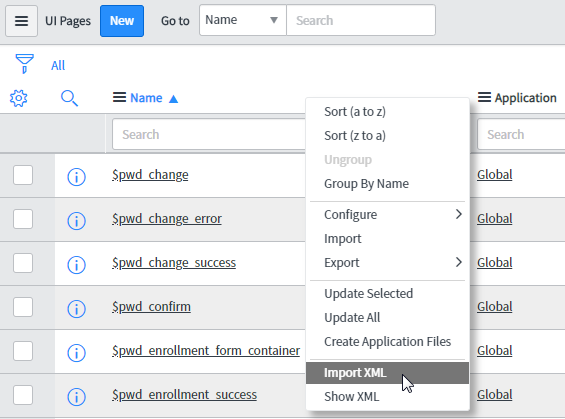

# alert_ui_page
XML for ServiceNow UI Page for an attractive, modal alert

This page is designed to be used in combination with a GlideModal instance to make JavaScript alerts more attractive.
To trigger this ui page from a client script, insert the below code in to your script where you would use an 'alert', or it can also 'confirm' for UI Actions.

## Future functionality
- [ ] btn colours
- [ ] posBtn processing (need to think about why someone would show an alert, what might they be trying to do)
  - [ ] if it's a client script could be form changes, abort action
  - [ ] if it's a ui action could be gsftSubmit
  - [ ] could be GlideAjax

## Install instructions
### Import the XML
- download the file sys_ui_page_823112c3db2100108988dde748961992.xml in this repository
- visit (your-instance).service-now.com/sys_ui_page_list.do
- open the context menu from the list header 
- select "Import XML'  

- upload the file

### Client script code
Copy the below code to your Client Script or UI Action and update the variables.
These instructions are also found in the UI Page description
```
var title = 'Placeholder Title'; //add a title to show at the top of the modal window, do not include it in the HTML below
var message = 'Placeholder Message' //add a message to be shown within the alert
var linkText = '';//include the link text you want to show
var linkUrl = '';//include the absolute or relative url you want the link to go to
var negBtn = 'Cancel'; //text to show on the negative button eg. 'Cancel'
var posBtn = 'OK'; //text to show on the positive button eg. 'Confirm' or 'OK'
var hideClose = false; //set true or false to include or exclude the 'X' from the top right of the modal window
var width = 300; //interger for the width of the modal. 300 is standard for alert, if you want a log alert without a scroll bar you will need to make it atleast 350 wide due to heisenberg styling

var gm = new GlideModal('alert_page',hideClose,width);
gm.setTitle(title);
gm.setPreference('sysparm_message',message);
gm.setPreference('sysparm_link_text',linkText);
gm.setPreference('sysparm_link_url',linkUrl);
gm.setPreference('sysparm_neg_btn',negBtn);
gm.setPreference('sysparm_pos_btn',posBtn);
gm.render();
```
